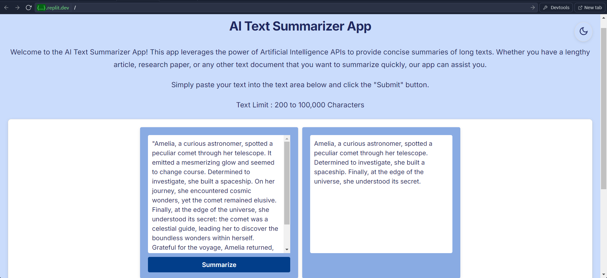
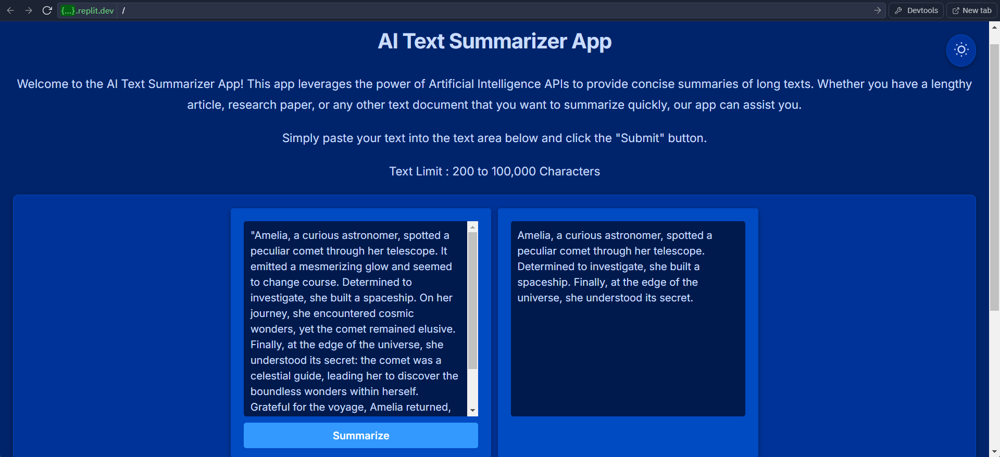

# 🤖 AI Text Summarizer

A modern web application that leverages the Hugging Face API (specifically the BART-large-CNN model) to generate concise summaries of long-form text content. This project was developed as part of the Postman Academy Project Based Learning course - "Build an AI Text Summarizer App".

<div align="center">
  
  <p><em>Light Mode</em></p>
  
  
  <p><em>Dark Mode</em></p>
</div>

## 📝 Project Overview

This project demonstrates the practical application of API integration and web development skills learned through Postman's educational program. It showcases how to:
- Work with third-party APIs (Hugging Face)
- Build a full-stack web application
- Implement modern UI/UX features
- Handle API authentication securely.

## ✨ Features

- **Smart Summarization**: Uses Facebook's BART-large-CNN model through Hugging Face's API
- **Character Limits**: Handles text between 200 and 100,000 characters
- **Dark Mode Support**: Toggle between light and dark themes with persistent preferences
- **Responsive Design**: Works seamlessly across desktop and mobile devices
- **Real-time Validation**: Input validation and button state management
- **Loading States**: Visual feedback during API calls

## 🚀 Quick Start

### Prerequisites

- Node.js installed on your system
- Hugging Face API access token
- npm or yarn package manager

### Installation

```bash
# Clone the repository
git clone https://github.com/yourusername/ai-text-summarizer.git

# Navigate to the project directory
cd ai-text-summarizer

# Install dependencies
npm install

# Set up environment variables
echo "ACCESS_TOKEN=your-huggingface-token" > .env
```

### Running the Application

```bash
# Start the server
npm start

# The application will be available at http://localhost:3000
```

## 🛠️ Tech Stack

### Frontend
- HTML5
- CSS3 with custom properties for theming
- Vanilla JavaScript
- Inter font family
- Responsive design with media queries
- Local storage for theme preferences

### Backend
- Node.js
- Express.js
- Axios for API calls
- Environment variables for secure token storage

## 📁 Project Structure

```
ai-text-summarizer/
├── public/
│   ├── index.html
│   ├── style.css
│   └── script.js
├── summarize.js       # API interaction logic
├── index.js          # Express server setup
└── package.json
```

## 💻 API Integration

### Hugging Face API
The project uses the BART-large-CNN model through Hugging Face's inference API for text summarization.

### Local API Endpoint
#### POST `/summarize`
Accepts text content and returns a summarized version.

#### Request Body
```json
{
  "text_to_summarize": "Your long text here..."
}
```

#### Parameters
- `max_length`: 100 (default)
- `min_length`: 30 (default)

## 🎨 UI Features

### Themes
The application supports both light and dark modes with a seamless toggle feature.

#### Light Theme Colors
- Background: `#CADCFC`
- Text Primary: `#1E2761`
- Container Background: `#ffffff`

#### Dark Theme Colors
- Background: `#00246B`
- Text Primary: `#CADCFC`
- Container Background: `#003399`

## 🔒 Security

- API tokens are stored in environment variables
- Input validation is implemented for text length
- Cross-site scripting (XSS) protection through proper content handling

## 🐛 Troubleshooting

Common issues and solutions:

1. **API Token Issues**: Ensure your Hugging Face API token is correctly set in the `.env` file
2. **Text Length Errors**: Verify your input is between 200 and 100,000 characters
3. **Server Connection**: Check if the server is running on port 3000

## 📚 Learning Resources

- [Postman Student Program](https://www.postman.com/student-program/student-expert/)
- [Postman Academy](https://academy.postman.com/)
- [Hugging Face Documentation](https://huggingface.co/docs)

## 👥 Credits

This project was created as part of the Postman Academy Project Based Learning curriculum. Special thanks to:
- Postman Education team for the comprehensive course material
- Hugging Face for providing the AI model API
- The open-source community for various tools and libraries used

## 📞 Support

For support:
1. Check the [Postman Learning Center](https://learning.postman.com/)
2. Join the [Postman Community](https://community.postman.com/)
3. Open an issue in this project's repository

---
<div align="center">
Made with ❤️ as part of the Postman Academy Project Based Learning Program
</div>